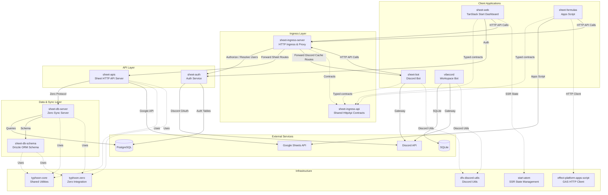
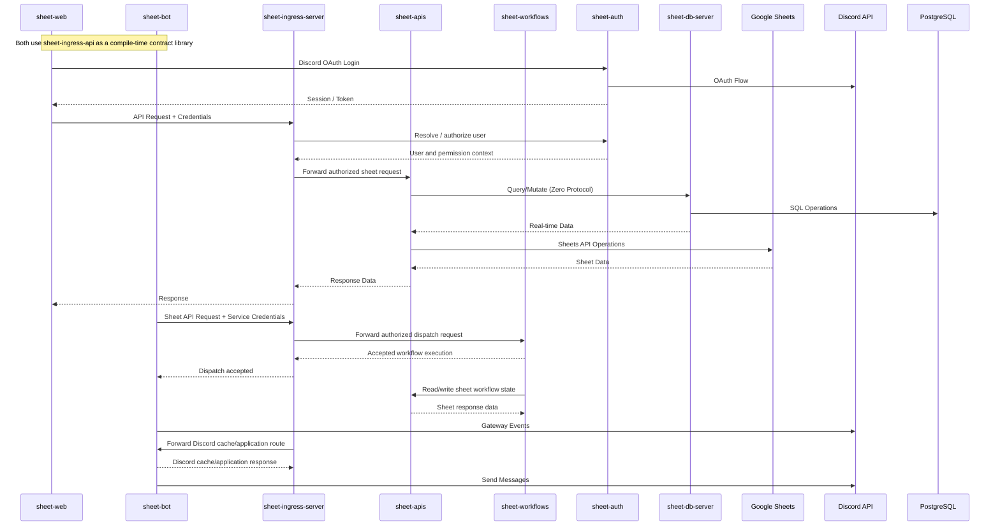
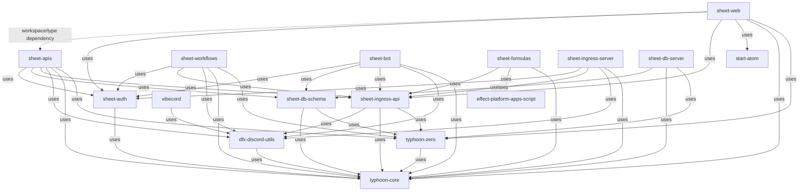

# TiaraStack Monorepo

A comprehensive monorepo containing tools for Google Sheets integration, Discord bot automation, HTTP ingress/proxying, and real-time collaborative applications.

## Overview

TiaraStack is a collection of interconnected services designed to provide seamless integration between Google Sheets, Discord, and web applications. The architecture follows a service-oriented design with shared API contracts, an ingress layer, backend services, and clear package boundaries.

## Architecture



## Package Structure

### Core Infrastructure

| Package                       | Description                              | Tech Stack      |
| ----------------------------- | ---------------------------------------- | --------------- |
| `typhoon-core`                | Shared utilities, schema helpers, errors | Effect.ts       |
| `typhoon-zero`                | Shared Rocicorp Zero integration helpers | Rocicorp Zero   |
| `bob`                         | Type-safe configuration builder          | Standard Schema |
| `dfx-discord-utils`           | Discord Effect utilities                 | dfx, unstorage  |
| `effect-platform-apps-script` | Effect HTTP client for Apps Script       | Effect Platform |
| `start-atom`                  | TanStack Start + Effect Atom integration | Effect Atom     |

### Application Services

| Package                | Description                                    | Tech Stack                                       |
| ---------------------- | ---------------------------------------------- | ------------------------------------------------ |
| `sheet-apis`           | Main HTTP API server for sheet operations      | Effect.ts, HttpApiBuilder, Playwright            |
| `sheet-workflows`      | Workflow runtime for dispatch and auto-checkin | Effect Cluster, Effect Workflow, PostgreSQL      |
| `sheet-ingress-server` | HTTP ingress/proxy for sheet and Discord APIs  | Effect.ts, HttpApiBuilder                        |
| `sheet-db-server`      | Real-time sync database server                 | Rocicorp Zero, Drizzle ORM                       |
| `sheet-auth`           | Authentication service with Discord OAuth      | Better Auth, Hono, Drizzle ORM                   |
| `sheet-web`            | Web dashboard for guild management             | TanStack Start, React, shadcn/ui                 |
| `sheet-bot`            | Discord bot for sheet workflows                | dfx, Effect.ts, Handlebars                       |
| `vibecord`             | Workspace/session management bot               | dfx, discord-api-types, SQLite, @opencode-ai/sdk |

### Data, Contracts & Integration

| Package             | Description                                        | Tech Stack                    |
| ------------------- | -------------------------------------------------- | ----------------------------- |
| `sheet-db-schema`   | PostgreSQL schema with Zero integration            | Drizzle ORM, drizzle-zero     |
| `sheet-ingress-api` | Shared HttpApi contracts, schemas, middleware tags | Effect HttpApi, Effect Schema |
| `sheet-formulas`    | Google Apps Script formulas library                | Effect.ts, Google Apps Script |

## Service Interactions

### Request Flow



### Data Flow

1. **Web Application** (`sheet-web`)

- Authenticates via `sheet-auth` using Discord OAuth
- Uses shared `sheet-ingress-api` contracts for typed backend calls
- Calls backend routes through the ingress/API path for sheet operations
- Uses `start-atom` for SSR-compatible state management

2. **Ingress API Contracts** (`sheet-ingress-api`)

- Defines shared Effect HttpApi groups, schemas, middleware tags, and RPC helpers
- Exposes sheet API groups plus Discord application/cache API groups
- Provides `SheetApisApi` and `SheetApisRpcs` for clients and servers
- Exports `.`, `./api`, `./api-groups`, middleware tag paths, `./sheet-apis`, `./sheet-apis-rpc`, and `./schemas/*`

3. **Ingress Server** (`sheet-ingress-server`)

- Serves the ingress HttpApi surface
- Applies CORS, telemetry, authorization, auth resolution, and message lookup
- Forwards authorized sheet routes to `sheet-apis`
- Forwards sheet bot/Discord application and cache routes to bot-facing services

4. **Discord Bot** (`sheet-bot`)

- Receives commands via Discord Gateway
- Uses `sheet-ingress-api` contracts for shared route and schema definitions
- Calls `sheet-ingress-server` with service credentials for sheet workflow dispatch
- Uses `dfx-discord-utils` for caching and command building
- Manages guild configurations and check-ins

1. **Workflow Runtime** (`sheet-workflows`)

- Runs durable dispatch and auto-checkin workflows using Effect Workflow/Cluster
- Calls `sheet-apis` through ingress contracts for sheet data and persistence
- Sends Discord responses through ingress bot-facing routes
- Stores workflow runner and message state in PostgreSQL

1. **API Server** (`sheet-apis`)

- Handles sheet business operations behind the ingress layer
- Integrates with Google Sheets via @googleapis/sheets and Playwright
- Queries PostgreSQL via `sheet-db-server` using Zero protocol
- Provides OpenTelemetry metrics and tracing

1. **Database Server** (`sheet-db-server`)

- Provides real-time sync using Rocicorp Zero
- Manages PostgreSQL schema via Drizzle ORM
- Handles query and mutation requests

1. **Apps Script** (`sheet-formulas`)

- Runs within Google Sheets environment
- Uses `sheet-ingress-api` contracts and `effect-platform-apps-script` for HTTP calls
- Calls backend routes through the ingress/API path

1. **VibeCord Bot** (`vibecord`)

- Standalone Discord bot with SQLite database
- Manages workspaces and sessions
- Integrates with OpenCode Agent Client Protocol
- Independent from sheet services

## Key Technologies

- **Effect.ts** (catalog v4.0.0-beta.56): Primary framework for type-safe, composable code
- **Rocicorp Zero**: Real-time sync protocol for database
- **TanStack Start**: Full-stack React framework with SSR
- **Drizzle ORM**: Type-safe SQL-like ORM for PostgreSQL and SQLite
- **Better Auth**: Authentication framework with Discord OAuth
- **dfx**: Discord Effect library for bot development
- **vite-plus (`vp`)** (catalog v0.1.15): Monorepo build, lint, format, and test tooling

## Development

### Prerequisites

- Node.js (LTS)
- pnpm
- PostgreSQL (for sheet services)
- Google Cloud project (for Sheets API)

### Setup

```bash
# Install dependencies
pnpm install

# Build all packages
pnpm build

# Run format checks across the monorepo
pnpm format

# Run lint plus type-aware type checks across the monorepo
pnpm lint

# Run tests across the monorepo
pnpm test

# Run workspace checks
pnpm checks

# Apply formatting
pnpm format:apply
```

### Package Scripts

Packages with source code generally support these scripts:

```bash
# From a package directory
pnpm build
pnpm format
pnpm format:apply
pnpm lint
pnpm test        # Only in packages that define tests
pnpm test:watch  # Only in packages that define tests

# Package-specific scripts (run from package directory)
pnpm db:generate    # Generate package-specific database migrations
pnpm db:migrate     # Run migrations
pnpm db:studio      # Open Drizzle Studio (vibecord only)
```

`sheet-db-schema` uses `effect-sql-kit` migration files under
`packages/sheet-db-schema/effect-sql-migrations/`. Generate schema changes with
`pnpm db:generate` and apply them with `pnpm db:migrate`. `sheet-auth` and `vibecord`
continue to use Drizzle-based database scripts.

Workspace scripts are defined in the repo root:

```bash
pnpm format        # vp run -r format
pnpm lint          # vp run -r lint
pnpm test          # vp run -r test
pnpm build         # vp run -r build
pnpm checks        # pnpm format && pnpm lint && pnpm test
pnpm format:apply  # vp run -r format:apply
```

In this repo, `pnpm lint` also performs type-aware TypeScript checking for the Vite+ packages because each package `vite.config.ts` enables `lint.options.typeAware` and `lint.options.typeCheck`.

## Project Structure

```
.
├── packages/
│   ├── typhoon-core/                 # Shared utilities, schema helpers, errors
│   │   ├── src/schema/               # Schema utilities
│   │   ├── src/utils/                # Utility functions
│   │   ├── src/error/                # Error handling
│   │   └── src/services/             # Core services
│   ├── typhoon-zero/                 # Shared Zero integration helpers
│   ├── bob/                          # Config builder utility
│   ├── dfx-discord-utils/            # Discord utilities
│   │   ├── src/discord/              # Discord-specific utils
│   │   ├── src/cache/                # Caching utilities
│   │   └── src/utils/                # Command builders & helpers
│   ├── effect-platform-apps-script/  # GAS HTTP client
│   ├── start-atom/                   # TanStack Start + Effect Atom
│   ├── sheet-apis/                   # Sheet HTTP API server
│   │   ├── src/config/               # Configuration
│   │   ├── src/handlers/             # API handlers
│   │   ├── src/services/             # Business logic
│   │   ├── src/middlewares/          # Auth middleware
│   │   └── src/test-utils/           # Test helpers
│   ├── sheet-workflows/              # Dispatch and auto-checkin workflow runtime
│   │   ├── src/cluster/              # Effect Cluster runtime
│   │   ├── src/workflows/            # Workflow definitions
│   │   ├── src/tasks/                # Background enqueue tasks
│   │   └── src/services/             # Workflow services and clients
│   ├── sheet-ingress-api/            # Shared ingress contracts and schemas
│   │   ├── src/api.ts                # Composed ingress HttpApi
│   │   ├── src/api-groups.ts         # Sheet API group exports
│   │   ├── src/handlers/             # Route contract groups
│   │   ├── src/middlewares/          # Middleware tags
│   │   ├── src/schemas/              # Shared request/response schemas
│   │   ├── src/sheet-apis.ts         # Sheet APIs contract surface
│   │   ├── src/sheet-apis-rpc.ts     # Sheet APIs RPC helpers
│   │   ├── src/sheet-workflows.ts    # Sheet Workflows contract surface
│   │   └── src/sheet-workflows-rpc.ts # Sheet Workflows RPC helpers
│   ├── sheet-ingress-server/         # Ingress/proxy server
│   │   ├── src/config/               # Configuration
│   │   ├── src/middlewares/          # Proxy authorization middleware
│   │   ├── src/services/             # Auth, lookup, and forwarding services
│   │   ├── src/telemetry.ts          # Telemetry layer
│   │   └── src/index.ts              # Server entrypoint
│   ├── sheet-db-server/              # Zero sync server
│   │   ├── src/handlers/zero/        # Zero handlers
│   │   ├── src/services/             # DB service
│   │   └── src/config/               # Configuration
│   ├── sheet-db-schema/              # Database schemas
│   │   ├── src/schema.ts             # Drizzle tables
│   │   └── src/zero/                 # Zero schema & mutators
│   │       ├── mutators/             # Zero mutations
│   │       └── queries/              # Zero queries
│   ├── sheet-auth/                   # Authentication service
│   │   ├── src/plugins/              # Auth plugins
│   │   ├── src/auth-config.ts        # BetterAuth config
│   │   └── src/schema.ts             # Auth tables
│   ├── sheet-web/                    # Web dashboard
│   │   ├── src/routes/               # TanStack routes
│   │   ├── src/components/           # React components
│   │   ├── src/lib/                  # Utilities & state
│   │   └── src/hooks/                # Custom hooks
│   ├── sheet-bot/                    # Discord bot
│   │   ├── src/commands/             # Slash commands
│   │   ├── src/config/               # Configuration
│   │   ├── src/discord/              # Discord API and gateway support
│   │   ├── src/middlewares/          # Authorization middleware
│   │   ├── src/services/             # Business logic
│   │   ├── src/messageComponents/    # Message components
│   │   └── src/tasks/                # Background tasks
│   ├── sheet-formulas/               # Apps Script formulas
│   │   └── src/formulas.ts           # Formula implementations
│   └── vibecord/                     # VibeCord bot
│       ├── src/bot/                  # Bot implementation
│       ├── src/commands/             # Slash commands
│       ├── src/services/             # Business logic
│       ├── src/db/                   # SQLite schema
│       └── src/sdk/                  # ACP integration
├── AGENTS.md                         # AI agent documentation
├── README.md                         # This file
└── package.json                      # Workspace root
```

## Dependencies Overview

### Direct Workspace Dependencies


