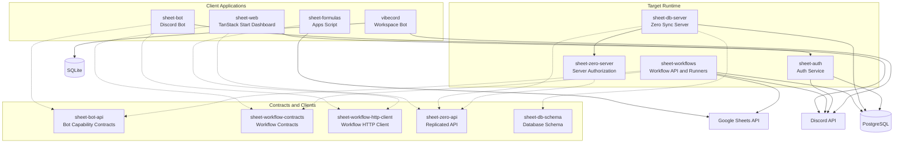

# TiaraStack Monorepo

TiaraStack combines Google Sheets integration, Discord bot automation, durable
workflow execution, and real-time collaborative applications.

## Architecture


```mermaid
flowchart TB
    subgraph Clients["Client Applications"]
        Web["sheet-web<br/>TanStack Start Dashboard"]
        Bot["sheet-bot<br/>Discord Bot"]
        Formulas["sheet-formulas<br/>Apps Script"]
        VibeCord["vibecord<br/>Workspace Bot"]
    end

    subgraph Runtime["Target Runtime"]
        Auth["sheet-auth<br/>Auth Service"]
        Workflows["sheet-workflows<br/>Workflow API and Runners"]
        Db["sheet-db-server<br/>Zero Sync Server"]
        ZeroServer["sheet-zero-server<br/>Server Authorization"]
    end

    subgraph Contracts["Contracts and Clients"]
        BotApi["sheet-bot-api<br/>Bot Capability Contracts"]
        WorkflowContracts["sheet-workflow-contracts<br/>Workflow Contracts"]
        WorkflowHttp["sheet-workflow-http-client<br/>Workflow HTTP Client"]
        ZeroApi["sheet-zero-api<br/>Replicated API"]
        Schema["sheet-db-schema<br/>Database Schema"]
    end

    Google["Google Sheets API"]
    Discord["Discord API"]
    Postgres[("PostgreSQL")]
    SQLite[("SQLite")]

    Web --> Auth
    Web -.-> ZeroApi
    Web -.-> WorkflowContracts
    Bot --> Discord
    Bot -.-> BotApi
    Bot -.-> WorkflowHttp
    Formulas -.-> WorkflowHttp
    Formulas --> Google
    Workflows --> Google
    Workflows --> Discord
    Workflows --> Postgres
    Workflows -.-> WorkflowContracts
    Workflows -.-> BotApi
    Db --> Postgres
    Db --> ZeroServer
    Db -.-> ZeroApi
    Db -.-> Schema
    ZeroServer -.-> ZeroApi
    Auth --> Discord
    Auth --> Postgres
    VibeCord --> Discord
    VibeCord --> SQLite
```

The production deployment contains only the target runtimes: authentication,
workflow API and runner roles, bot, web, database/Zero sync, Zero Cache, and
supporting observability resources. Google service-account credentials are
bound to the workflow runner roles.

## Packages

### Runtime packages

| Package | Purpose |
| --- | --- |
| `sheet-auth` | Better Auth service with Discord OAuth and service-token support |
| `sheet-workflows` | Durable workflow API, ordinary runner, and browser runner |
| `sheet-bot` | Discord bot and typed bot capability HTTP routes |
| `sheet-web` | TanStack Start dashboard for guild management and scheduling |
| `sheet-db-server` | Zero sync and database HTTP server |
| `sheet-formulas` | Google Apps Script formulas and workflow HTTP integration |
| `vibecord` | Independent Discord workspace/session bot |

### Contracts and shared libraries

| Package | Purpose |
| --- | --- |
| `sheet-domain` | Transport-neutral sheet values and stable business rules |
| `sheet-bot-api` | Typed bot cache, delivery, and Response Reference contracts |
| `sheet-workflow-contracts` | Typed workflow dispatch, observation, and enqueue contracts |
| `sheet-workflow-http-client` | HTTP client for workflow runtime routes |
| `sheet-zero-api` | Replicated schema, procedures, and typed Zero clients |
| `sheet-zero-server` | Server-side Zero authorization and persistence implementation |
| `sheet-db-schema` | PostgreSQL schema, migrations, and generated Zero schema source |
| `sheet-message-content` | Deterministic messaging content and rendering helpers |
| `effect-zero-workflow` | Reusable Zero-native Effect Workflow component |
| `typhoon-core` | Shared schema, error, and configuration utilities |
| `typhoon-zero` | Shared Rocicorp Zero integration helpers |

## Development

Prerequisites are Node.js LTS, pnpm, PostgreSQL for database-backed work, and a
Google Cloud project when exercising Sheets operations.

```sh
pnpm install
pnpm build
pnpm format
pnpm lint
pnpm test
pnpm checks
npx fallow audit
pnpm format:apply
```

Workspace commands are defined in the root `package.json`:

- `pnpm format`: check formatting across packages
- `pnpm lint`: run lint and type-aware checks
- `pnpm test`: run package tests
- `pnpm build`: build all packages
- `pnpm checks`: run format, lint, and tests
- `pnpm format:apply`: apply repository formatting

For local single-machine development, see
[`deploy/compose/README.md`](deploy/compose/README.md). The Helm chart and its
secret contract are documented in
[`charts/tiara-stack/README.md`](charts/tiara-stack/README.md).

## Repository layout

```text
packages/
├── effect-zero-workflow/       Zero-native durable workflow component
├── typhoon-core/               Shared utilities
├── typhoon-zero/               Shared Zero integration
├── sheet-domain/               Domain values
├── sheet-auth/                 Authentication runtime
├── sheet-bot-api/              Bot capability contracts
├── sheet-workflow-contracts/   Workflow contracts
├── sheet-workflow-http-client/ Workflow HTTP client
├── sheet-zero-api/             Replicated Zero API
├── sheet-zero-server/          Server-side Zero implementation
├── sheet-db-schema/            Database schema and migrations
├── sheet-db-server/            Zero sync runtime
├── sheet-workflows/            Workflow API and runner runtime
├── sheet-bot/                  Discord bot runtime
├── sheet-web/                  Web runtime
├── sheet-formulas/             Apps Script runtime
├── sheet-message-content/      Messaging helpers
└── vibecord/                   Independent workspace bot
```
